<h1 align="center">Stargazers Website</h1>

[View the deployed project here](https://mtelewa.github.io/nightsky-gazers/gear.html)

STARGAZERS is a website for amateur and professional astronomers to get to know top stargazing locations and a basic understanding of the gear involved and most importantly to meet up. The website thrives on getting the astronomer community closer on a global scale.

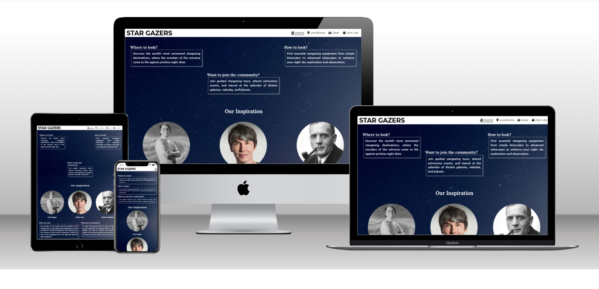

## Contents
* [User Experience (UX)](#user-experience-ux) 
* [Design](#design)
    * [Color scheme](#color-scheme)
    * [Typography](#typography)
    * [Imagery](#imagery)
    * [Wireframes](#wireframes)
    * [Accessibility](#accessibility)
* [Features](#features)
* [Technologies Used](#technologies-used)
    * [Languages](#languages)
    * [Frameworks and Libraries](#frameworks)
* [Testing](#testing)
    * [Validator Testing](#validator)
    * [Browser Compatibility](#compatibility)
    * [Test Cases and Results](#test-cases)
    * [Known Bugs](#bugs)
* [Deployment & Local Development](#deployment-development)
    * [Deployment](deployment)
    * [Local Development](#development)
* [Credits](#credits)
    * [Code Used](#code-used)
    * [Content](#content)
    * [Media](#media)
    * [Acknowledgement](#acknowledgement)

- - -

## User Experience (UX)

### User Stories

#### First Time Visitor Goals

* I want to join a stargazing community nearby, I am interested in astronomy but I don't know where and how to begin
* I want to understand the difference between different stargazing equipment
* I want to meet up with people sharing the same interest
* I want the site to be responsive to my device
* I want the site to be easy to navigate

#### Returning Visitor Goals

* I want the information about stargazing locations to be in one place
* I want the site to be responsive to my device
* I want the site to be easy to navigate

#### Frequent Visitor Goals

* I am travelling around and want to check new places for stargazing and meet other stargazers there
* I want to contact the organisation to give feedback or ask questions

- - -

## Design

### Colour Scheme

The colors chosen were based on the background image of a stary night sky. The colors shall give the user a feeling of a calm night in the desert or from a mountain top - just like how it would be when stargazing. The color palette used is inspired by
 
 

    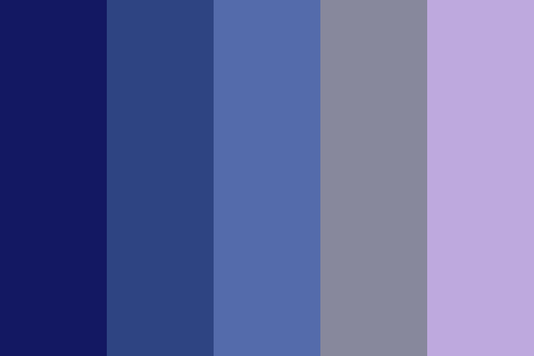

Aside from the dark blue background image, I have used mainly 

* `rgba(191,191,191,0.4)` for `div` boxes border and shadow
* `rgba(7, 3, 51, 0.6)` for the footer background
* `color:rgb(253, 165, 0)` for hover effects
* `#ffffff` for the font to provide contrast against the background

### Typography

Google Fonts was used to import the chosen fonts. The three main fonts used across the website are

* For the `h1` and navigation icons `nav` in the header, [Montserrat](https://fonts.google.com/specimen/Montserrat) 

* For the paragraphs `p` and `h3`, [Hind Madurai](https://fonts.google.com/specimen/Hind+Madurai)

* For everything else, [Lora](https://fonts.google.com/specimen/Lora)

The choice was inspired by [Font joy](https://fontjoy.com/#).

### Imagery

The website calls for looking up into the stars, so I wanted to give this experience with minimum distraction from the content. The image was pulled from [Freepik](https://www.freepik.com/).

### Wireframes

Wireframes were based on hand sketches on my personal tablet using a stylus. Since the initial wireframes differ a lot from the final website, I decided not to include them here. However, for future projects, I am sure [Balsamiq](https://balsamiq.com/) or [Figma](https://figma.com/) will be essential.

### Accessibility

The website is as accessible as possible. Specifically by following these good-practice guidelines

* Accessible Rich Internet Applications (Aria) labels on interactive elements, links and icons
* Semantic HTML
* Using a hover state on all buttons on the website

  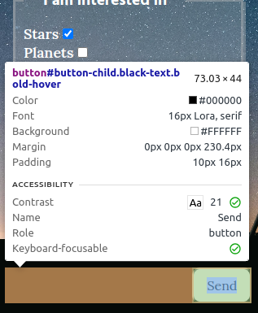

* Sufficient color contrast throughout the site including dark blue background as a fallback color in case the background images do not load (this was later removed as it made the website look buggy as it loads!)

I used the chrome extension [Web Disability Simulator](https://chrome.google.com/webstore/detail/web-disability-simulator/olioanlbgbpmdlgjnnampnnlohigkjla) to check for **total** as well as **Yellow-blue color blindness (Tritanopia)** color blindness. The latter was checked as blue is the prevailing color throughout the website. The reults are shown here, respectively.

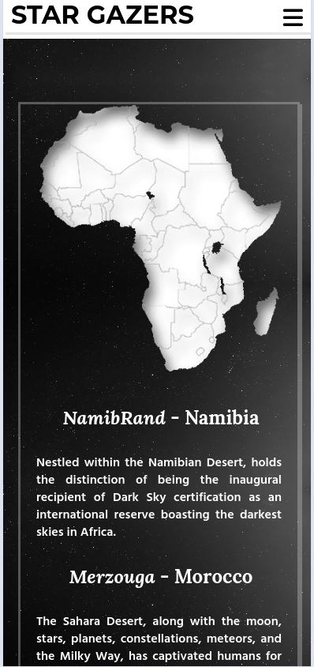
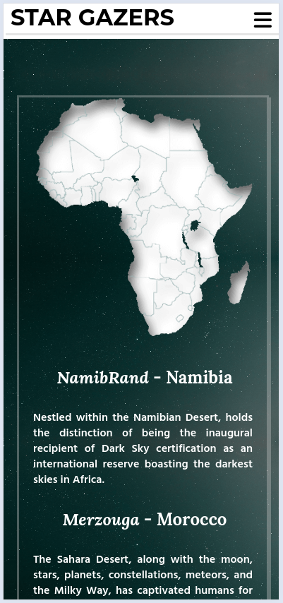

As can be concluded, there is still enough contrast between the text and the background.

- - - 

### Features

The website consists of 
* Home page with quick links to other pages and about-us information
* Locations page to show top stargazing sites
* Gear page to present the comonly-used telescopes and their differences
* Join Us! page for sign-up and writing feedback or any message

The main features of the website are

* A **favicon** in the browser tab.

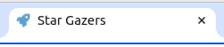

* The header and navigation bar **on every page** to **facilitate steering** on the website. With **hovering effects** (in orange) and **underline** to **show the current page**. The navigation bar also has **icons** from [Font Awesome](https://fontawesome.com/) for **easier visualisation**

* The home page features three main boxes at the top of the page. The **headings of these boxes are clickable** and **navigate the user** to the corresponding page. The "Where to look?" leads to "Locations" page, the "How to look?" leads to the "Gear" page and the "Want to join the community?" leads to the "Join Us!" page

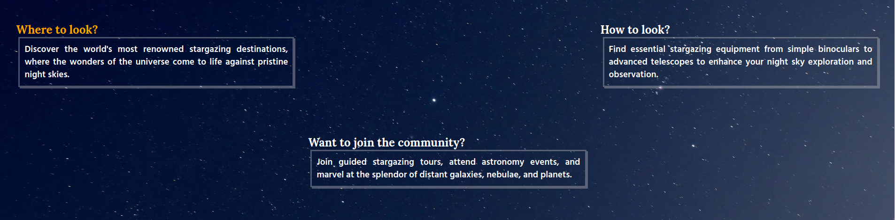

* **Toggle dialog boxes** to present additional information about our inspirational figures **without filling the page with text**.

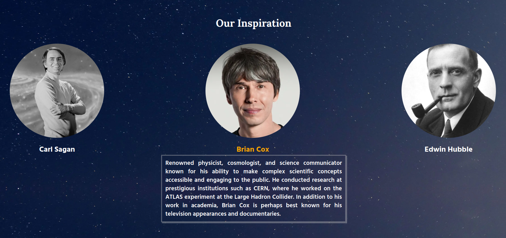

* **Interactive `iframe`** adopted from [Nasa](https://eyes.nasa.gov/apps/solar-system/#/home) at the bottom of the home page. This allows the user to **check the current sky alignment**, also go back and forward in time to visualise the solar system in the past as well as the future as predicted by Nasa 

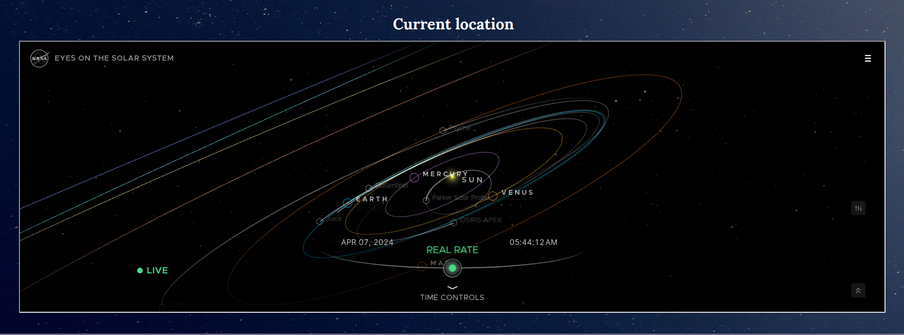

* **External links** for additional information on our stargazing sites

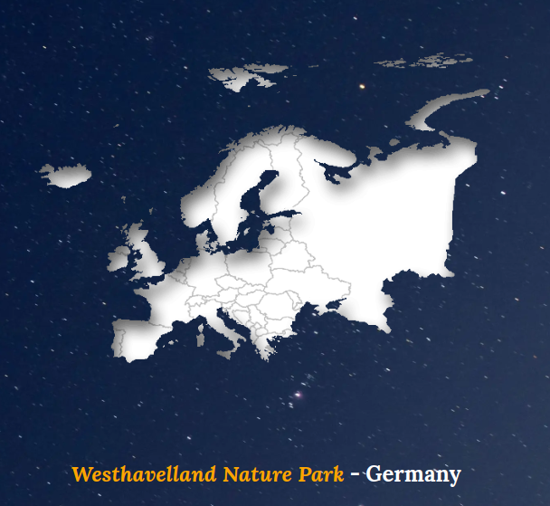

* **Responsive design** to different display sizes (more on that in the [Testing](#testing) section)

* **Message/Feedback** box for contacting the organisation

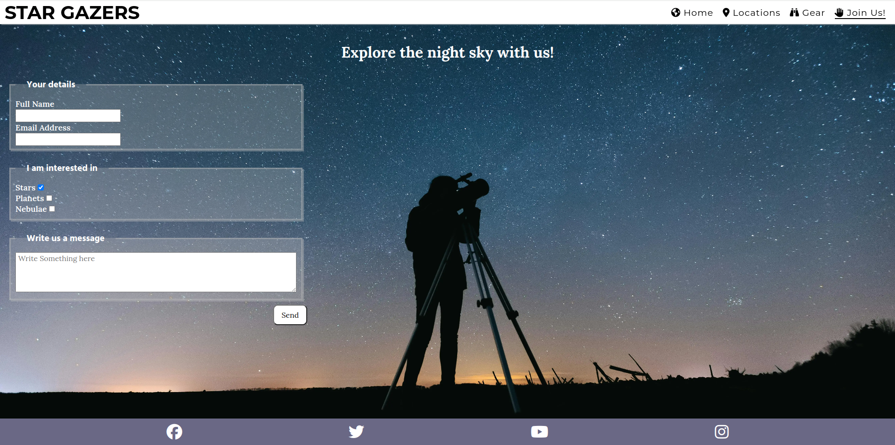
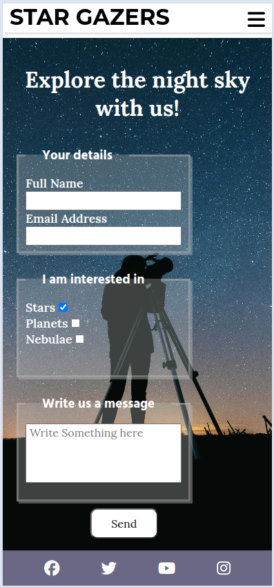

* Future Implementations that shall allow returning and frequent users to visit more often

    * Create a forum for users to communicate with each other on the platform
    * Add 'News' section to share the latest in the astronomy community 
    * Add an up-to-date 'Gallery' page to showcase the images taken by our astrophotographers community
    * Add 'search' box in the navigation bar 
    * Add 'Fun fact' pop-ups to make the website more interacive and include all ages

- - -

## Technologies Used

### Languages

* HTML5
* CSS3

### Frameworks & Libraries

* [Git](https://git-scm.com/) for version control

* [Github](https://github.com/) to store code and other files

* [GitPod](https://gitpod.io/) IDE to create and edit the codes

* [Google Fonts](https://fonts.google.com/) to import the fonts used on the website.

* [Google Developer Tools](https://developers.google.com/web/tools) for troubleshooting, checking responsiveness and styling

* [Fonticon](https://gauger.io/fonticon/) to create the favicon

* [Ilovemage](https://www.iloveimg.com/) to compress and resize images

* [Resize Pixel](https://www.resizepixel.com/mirror-image/) to mirror images

* [IMGonline](https://www.imgonline.com.ua/eng/combine-two-images-into-one.php) to merge two images into one

* [Cloud convert](https://cloudconvert.com/jpg-converter) to convert jpg to webp format

* [Techsini](https://techsini.com/multi-mockup/) to show the website image on a range of devices

* [Lighthouse](https://chromewebstore.google.com/detail/lighthouse/blipmdconlkpinefehnmjammfjpmpbjk) to check the performance, quality, and correctness of the webpage

* [Web Disability Simulator](https://chrome.google.com/webstore/detail/web-disability-simulator/olioanlbgbpmdlgjnnampnnlohigkjla) to simulate other accessibility needs

- - -

## Testing

- - -

## Deployment & Local Development

### Deployment

The website is deployed using GitHub Pages. To Deploy the website:

1. Go to the [nightsky-gazers](https://github.com/mtelewa/nightsky-gazers/) repository for this project on Github - this was the initial name of the website
2. Navigate to settings/pages
3. From the source dropdown select "Deploy from a branch" and press save
4. The site has now been deployed and the website goes live

### Local Development

#### How to Fork

To fork the repository:

1. Go to the [nightsky-gazers](https://github.com/mtelewa/nightsky-gazers/) repository
2. Click the "Fork" button in the top right corner.

#### How to Clone

To clone the repository:

1. Go to the [nightsky-gazers](https://github.com/mtelewa/nightsky-gazers/) repository
2. Click on the "Code" button, select "SSH" and copy the link
3. Open the terminal and change the current working directory to the location you want the cloned directory to be in
4. Use the command `git clone git@github.com:mtelewa/nightsky-gazers.git` into the terminal

Note: For step no.4 to work, first generate SSH keys and add your generated key in Account Settings -> SSH Keys. More on this can be found on the [github docs](https://docs.github.com/en/authentication/connecting-to-github-with-ssh/adding-a-new-ssh-key-to-your-github-account).

- - -

## Credits

### Code Used

* Hover two elements simultaneously [snippet](https://stackoverflow.com/questions/1462360/css-hover-one-element-effect-for-multiple-elements)

* Ignore white space in text field [snippet](https://stackoverflow.com/questions/13766015/is-it-possible-to-configure-a-required-field-to-ignore-white-space)

* Center a `button` element within a `div` [snippet](https://stackoverflow.com/questions/15300234/how-can-i-horizontally-center-a-button-element-in-a-div-element)

* [Developer mozilla](https://developer.mozilla.org/), [CSS tricks](https://css-tricks.com/) and [W3Schools](https://www.w3schools.com/) were valuable resources for quickly checking declarations, attributes and values syntax of HTML and CSS

### Content

* [Stargazing sites around the world](https://www.travelandleisure.com/trip-ideas/nature-travel/best-places-to-see-stars-around-the-world)
* [Stargazing sites in Africa](https://onlyone.africa/5-places-to-stargaze-in-africa/)
* [Stargazing sites in Europe](https://www.tourradar.com/days-to-come/best-stargazing-and-astronomy-tours-in-europe-by-locals/)
* [Stargazing sites in Asia](https://www.jetstar.com/sg/en/inspiration/articles/best-stargazing-spots-asia)
* [Telescopes](https://www.telescopefinder.com/reflector-vs-refractor-telescope/)

### Media

* [Carl Sagan image](https://medium.com/@codelamps/the-philosophy-of-life-based-on-carl-sagan-cosmos-curiosity-and-humble-inquiry-e595440bf820)
* [Brian Cox image](https://www.bbc.com/news/science-environment-50681661)
* [Edwin Hubble image](https://en.wikipedia.org/wiki/Edwin_Hubble#/media/File:Studio_portrait_photograph_of_Edwin_Powell_Hubble_(cropped).JPG)
* [Main background image](https://www.freepik.com/photos/night-sky-background)
* [Signup background image](https://www.pexels.com/photo/silhouette-of-person-standing-on-a-field-under-starry-night-8495473/)
* [Maps images](https://www.worlddata.info/)

### Acknowledgments

I would like to thank my Code Institute mentor Jubril Akolade for his feedback and support
